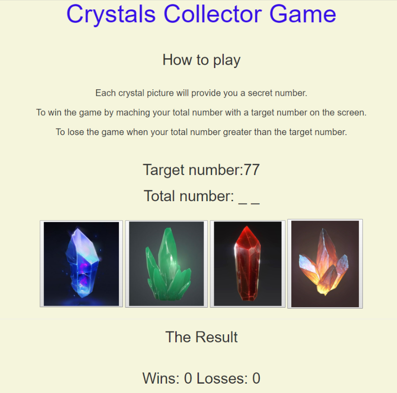

# Unit-4-game

This is the fourth assignment for Rutgers Coding Bootcamp Delivered by Trilogy Education Services, Inc.

<<<<<<< HEAD
In this assignment, we were required to create a Crystals Collector game. This game uses HTML, css and jQuery library to run the game
=======
# Details about this project

In this assignment, we were required to create a Crystals Collector game. This game uses HTML, css, and jQuery library to run the game.
>>>>>>> 7d51225ffaea1623e3e53b80c2d2ef91c3a03c9d

**Crystal Collector**

# Instructions:

Each crystal picture will provide you a secret number.
To win the game by maching your total number with a target number on the screen.
To lose the game when your total number greater than the target number.

Click on the following link to preview the completed assignment.  
 https://nan227.github.io/Unit-4-game/

## Built With

* HTML5
* CSS3
* JavaScript 
<<<<<<< HEAD

=======
>>>>>>> 7d51225ffaea1623e3e53b80c2d2ef91c3a03c9d
